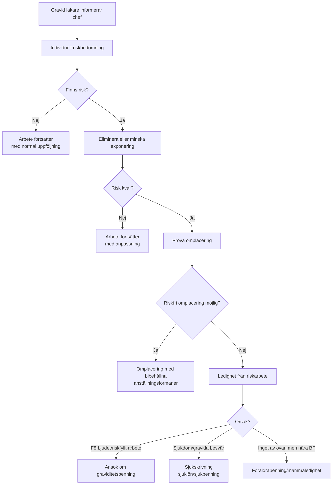
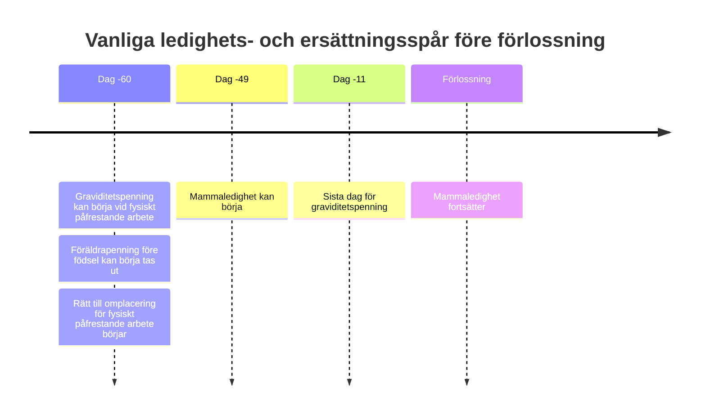

# Gravid läkare i Region Stockholm

Den här rapporten utgår från att läkaren är **anställd** av entity["organization","Region Stockholm","Stockholm, Sweden"] eller av ett regionägt bolag inom regionen, inte inhyrd konsult eller anställd hos privat vårdgivare med vårdavtal. Där offentlig information saknas om lokala HR-rutiner redovisar jag det uttryckligen. Regionens egen medarbetarinformation ligger i stor utsträckning på intranät, vilket innebär att vissa lokala processer inte kan verifieras externt. citeturn28search14

## Sammanfattning

För en gravid läkare i Region Stockholm är den rättsliga kärnan i huvudsak densamma oavsett arbetsplats: arbetsgivaren ska göra en **individuell riskbedömning**, undanröja eller minska risker, därefter **omplacera** om det behövs, och först om riskfri lösning inte går att ordna får den gravida tas ur det aktuella arbetet. Vid omplacering enligt föräldraledighetslagen ska anställningsförmånerna som huvudregel bibehållas. Om omplacering inte är möjlig uppstår normalt ledighet **utan arbetsgivarbetald lön**, och då blir i stället **graviditetspenning**, **sjukskrivning/sjuklön/sjukpenning** eller **föräldrapenning före förlossning** de centrala ersättningsspåren. citeturn16view0turn17view2turn19view0turn14view0turn11view0turn13view0turn9view0turn41search5

Det som **inte** i någon större offentlig utsträckning skiljer sig mellan sjukhusen är de materiella arbetsmiljöreglerna; de följer samma nationella lagstiftning, entity["organization","Arbetsmiljöverket","Swedish work env authority"]s föreskrifter och samma socialförsäkringsregler. Det som **kan** skilja sig är lokala beslutsvägar, vilka HR-blanketter och vilken företagshälsovård som används, samt vissa offentligt redovisade personalförmåner. Den tydligaste verifierade skillnaden i denna genomgång gäller **föräldrapenningtillägg/föräldralön**: flera arbetsgivare anger 180 dagars kvalifikationstid, medan entity["organization","Södersjukhuset","Stockholm, Sweden"] offentligt anger 356 dagar. entity["organization","Karolinska Universitetssjukhuset","Stockholm, Sweden"] redovisar dessutom en lokalt generösare modell för utökad ledighet än lagens miniminivå. citeturn34view2turn34view3turn34view4turn34view5turn33view0turn34view0

För läkare är de praktiskt viktigaste riskområdena vanligtvis **joniserande strålning**, **smittämnen**, **nattarbete/skiftarbete**, **tung fysisk belastning** och i vissa verksamheter **anestesigaser**, **cytostatika** eller andra CMR-klassade kemiska exponeringar. För joniserande strålning är den tydligaste nationella gränsen att fosterdosen, om den gravida arbetar kvar, ska hållas så låg som möjligt och inte överstiga **1 mSv under återstoden av graviditeten**. För nattarbete finns ett uttryckligt skydd om läkarintyg visar att nattarbete är skadligt, och regionalt kunskapsstöd rekommenderar i praktiken högst **en natt per vecka** under graviditet. citeturn38view0turn40view0turn40view1turn35search1turn35search14

Avtalsrättsligt följer regionanställda läkare inte statens Saco-S-spår. För läkare i regioner och kommuner är den centrala avtalsramen i stället **HÖK 25 med OFR:s förbundsområde Läkare**, tillsammans med **AB 25** och **Specialbestämmelser för läkare**. Saco-S blir relevant endast om läkaren också har en **separat statlig anställning**, till exempel hos universitet eller statlig myndighet. citeturn21search0turn21search3turn20search0turn21search1turn22search0

## Avgränsning och rättskällor

De mest bärande rättskällorna är arbetsmiljölagen, föräldraledighetslagen, lagen om sjuklön och socialförsäkringsbalken. Därtill kommer Arbetsmiljöverkets nu gällande regelstruktur i **AFS 2023:2 kapitel 7** om gravida, nyförlösta och ammande arbetstagare. Regionens eget kunskapsstöd från **Centrum för arbets- och miljömedicin** hänvisar fortfarande till äldre AFS-numrering i sitt faktablad, men anger samtidigt att omnumrering pågår och att aktuell rätt ska kontrolleras på Arbetsmiljöverkets webbplats; Arbetsmiljöverkets nuvarande webbplats placerar reglerna i AFS 2023:2. citeturn16view0turn14view0turn9view0turn11view0turn13view0turn38view0turn35search14

Kollektivavtalsmässigt är huvudspåret för regionanställda läkare **HÖK 25 med OFR Läkare**. Kärnan i allmänna anställningsvillkor ligger i **AB 25**, medan **Specialbestämmelser för läkare** innehåller läkarspecifika regler om bland annat arbetstid, jour och beredskap. I det material jag har gått igenom finns däremot inga läkarspecifika graviditetsregler som ersätter de lagstadgade spåren; graviditet styrs därför främst av lag, arbetsmiljöföreskrifter och lokala arbetsgivarpolicys om ersättningsnivåer. citeturn21search0turn21search3turn20search0turn21search1turn20search6

För intern regional styrning har jag kunnat verifiera två typer av offentliga källor. Dels generella förmånssidor från regionen och flera större arbetsgivare, dels kunskapsstöd från regionens CAMM om graviditet, nattarbete och arbetsanpassning. Däremot framgår av regionens webbplats att mycket av medarbetarinformationen ligger på intranät, vilket gör att lokala rutinbeskrivningar för exempelvis riskbedömningsblanketter eller beslutsgång inte alltid kan visas offentligt. citeturn34view5turn34view0turn34view1turn34view2turn34view3turn34view4turn33view0turn28search1turn28search10turn28search14

## Rättslig ram

### Nationell lagstiftning

Arbetsmiljölagen lägger grundansvaret på arbetsgivaren. Arbetsmiljön ska vara anpassad till människors olika förutsättningar, arbetsgivaren ska vidta alla åtgärder som behövs för att förebygga ohälsa och olycksfall, systematiskt undersöka risker, dokumentera och tidsplanera åtgärder samt ha företagshälsovård att tillgå när verksamheten kräver det. Skyddsombud ska delta i planering av förändringar och kan begära åtgärder; vid omedelbar och allvarlig fara kan de också stoppa arbete i avvaktan på myndighetsprövning. Detta är direkt relevant om en gravid läkare upplever att arbetsgivaren dröjer med riskbedömning eller omplacering. citeturn16view0turn17view2turn19view0

Föräldraledighetslagen innehåller tre särskilt viktiga spår. För det första har den gravida rätt till **mammaledighet** under minst sju veckor före beräknad förlossning och sju veckor efter förlossningen; två veckor är obligatoriska före eller efter om hon inte är ledig på annan grund. För det andra har den gravida rätt till omplacering med **bibehållna anställningsförmåner** om hon förbjudits att fortsätta sitt vanliga arbete enligt föreskrift meddelad med stöd av arbetsmiljölagen. För det tredje finns ett särskilt omplaceringsspår för **fysiskt påfrestande arbetsuppgifter** från och med dag 60 före beräknad förlossning. Om omplacering inte är möjlig har hon rätt till ledighet så länge det krävs för att skydda hälsa och säkerhet, men **utan bibehållna anställningsförmåner** under den ledigheten. Arbetsgivaren ska lämna besked om omplacering **snarast möjligt** och därefter fortlöpande pröva om omplacering blir möjlig. citeturn14view0turn14view1

Lagen om sjuklön och reglerna om sjukpenning gäller när frånvaron beror på **sjukdom**, inte bara på graviditet i sig. Arbetsgivaren ansvarar för sjuklön under de första 14 dagarna av sjukperioden; sjuklönen är 80 procent av anställningsförmånerna med karensavdrag, och arbetsgivaren får kräva läkarintyg från dag 8 enligt huvudregeln. Efter sjuklöneperioden tar sjukpenningreglerna i socialförsäkringsbalken över, och rätt till sjukpenning kräver att sjukdom sätter ned arbetsförmågan med minst en fjärdedel. För en gravid läkare betyder det att vanliga graviditetsbesvär som når sjukdomsnivå, exempelvis hyperemesis, bäckensmärta eller graviditetsrelaterad hypertoni, i princip hör hemma i sjukskrivningsspåret, medan en ren arbetsmiljörisk utan egen sjukdom hör hemma i graviditetspenningsspåret. citeturn9view0turn13view0turn13view1

Socialförsäkringsbalkens graviditetspenning delas i praktiken i två huvudspår. Det första gäller när graviditeten gör arbetet **fysiskt för ansträngande** och omplacering inte går; då kan graviditetspenning betalas tidigast från **dag 60 före beräknad förlossning**. Det andra gäller när arbetstagaren **inte får sysselsättas** på grund av en graviditetsspecifik skyddsföreskrift och omplacering inte går; då kan graviditetspenning betalas för varje dag förbudet gäller. I båda fallen lämnas graviditetspenning längst till och med **dag 11 före beräknad förlossning**, och den beräknas enligt sjukpenningreglerna. Försäkringskassans och Högsta förvaltningsdomstolens sammanfattningar beskriver nivån som ungefär 80 procent av SGI upp till taket. citeturn11view0turn11view1turn35search0turn35search4turn39search1turn39search4

### Kollektivavtal

För regionanställda läkare är den centrala avtalsramen **HÖK 25 med OFR:s förbundsområde Läkare**, giltig 1 april 2025 till 31 mars 2027. HÖK 25 bygger på **AB 25** som gemensam bas för allmänna anställningsvillkor, med särskilda bilagor för läkare. **Specialbestämmelser för läkare** omfattar bland annat arbetstid, jour och beredskap, men de graviditetsspecifika rättigheterna kommer primärt från lagstiftningen ovan. Det praktiskt viktigaste avtalslagret i graviditetsfrågor är därför ofta de lokala ersättningsbestämmelserna för föräldrapenningtillägg, föräldralön och ibland sjuklönetillägg. citeturn21search0turn21search3turn20search0turn21search1

**Saco-S** är inte det tillämpliga spåret för en läkare som är anställd av regionen. entity["organization","Sveriges läkarförbund","Swedish medical association"] anger uttryckligen att statligt anställda läkare följer kollektivavtalen mellan Saco-S och Arbetsgivarverket, medan region- och kommunanställda läkare följer Läkarförbundets avtal i kommunal-regional sektor. Det är därför viktigt att skilja mellan en läkartjänst i regionen och en eventuell **parallell statlig anställning**. Vid kombinationsanställningar kan sjuk- och föräldraförmåner bli mindre förmånliga eller administrativt mer komplicerade, eftersom flera anställningar bedöms var för sig. citeturn22search0turn22search2turn22search4

## Region Stockholm och arbetsgivarna

Den offentligt verifierade bilden är att de stora arbetsgivarna i regionen följer samma lagstiftning och i huvudsak samma kollektivavtalsstruktur, men att **lokala förmånssidor inte är helt harmoniserade**. Det gäller framför allt kvalifikationstid och presentation av föräldrapenningtillägg/föräldralön. Den slutsats jag drar är därför att den gravida läkaren bör utgå från att **arbetsmiljöreglerna är gemensamma**, men att **lön/ersättning** måste verifieras hos den egna juridiska arbetsgivaren. citeturn34view0turn34view1turn34view2turn34view3turn34view4turn34view5turn33view0turn28search14

| Arbetsgivare | Offentligt verifierad huvudregel om föräldratillägg | Offentligt verifierad lokal särart som kan vara praktiskt viktig | Bedömning för graviditetsregler |
|---|---|---|---|
| entity["organization","Karolinska Universitetssjukhuset","Stockholm, Sweden"] | Offentlig sida anger mellanskillnad upp till 80 % av månadslönen i 180 dagar per barn. citeturn34view0 | Offentlig sida anger, **med chefs godkännande**, möjlighet till hel ledighet tills barnet fyllt 3 år och 75 % arbete tills barnet fyllt 12 år. citeturn34view0 | Inga offentligt verifierade avvikande graviditets-säkerhetsregler identifierade. Kontrollera intranät/lokal rutin. citeturn28search14 |
| entity["organization","Danderyds sjukhus","Stockholm, Sweden"] | 10 % av lönebortfallet i 180 dagar; kvalifikationstid minst 180 dagar; mellanskillnadsersättning över 10 prisbasbelopp. citeturn34view2 | Förmånssidan refererar även till Region Stockholms samlade förmåner. citeturn27search0turn34view5 | Offentligt ingen särskild graviditetsrutin funnen. Samma lag/AFS/FK-spår gäller. |
| entity["organization","Södersjukhuset","Stockholm, Sweden"] | 10 % av lönebortfallet i 180 dagar, men offentlig sida anger **356 dagars** sammanhängande anställning före ledigheten. citeturn34view3 | Offentlig sida anger också flextid, individuell schemaläggning och extra sjukersättning dag 15–90. citeturn34view3 | Den publika 356-dagarsregeln avviker från flera andra regionarbetsgivare och bör därför dubbelkontrolleras med HR/fack. |
| entity["organization","S:t Eriks Ögonsjukhus","Solna, Sweden"] | 10 % av lönebortfallet i 180 dagar till barnets 24 månader; föräldralön över tak om viss arbetstid hos arbetsgivaren, på sidan uttryckt som minst sex månader för extra ersättning. citeturn33view0 | Offentlig sida uttrycker kvalifikationstiden delvis allmänt, vilket gör exakt tillämpning mindre tydlig än hos andra arbetsgivare. citeturn33view0 | Graviditetsskyddet följer samma lagstiftning; kontrollera lokal tolkning av kvalifikationstid. |
| entity["company","Tiohundra","Norrtalje, Stockholm, Sweden"] | 10 % av lönebortfallet i 180 dagar; minst 180 dagars sammanhängande anställning; mellanskillnadsersättning över 10 prisbasbelopp. citeturn34view4 | Offentlig sida anger också rätt att gå ned till 75 % med barn upp till 12 år. citeturn34view4 | Inga offentligt verifierade avvikande graviditets-säkerhetsregler identifierade. |
| entity["organization","Stockholms läns sjukvårdsområde","Stockholm, Sweden"] | 10 % av lönebortfallet i 180 dagar; föräldralön upp till 270 dagar per födsel; totalt cirka 90 % av lönen enligt offentlig sida. citeturn34view1 | Offentlig sida anger dessutom direkt tillgång till företagshälsovård/rådgivning upp till två tillfällen per år. citeturn34view1 | Praktiskt viktigt för primärvårds- och psykiatriläkare eftersom FHV-kontakten framgår tydligare offentligt här än hos flera sjukhus. |
| entity["organization","Region Stockholm","Stockholm, Sweden"] som generell arbetsgivarsida | 10 % av lönen i upp till 180 dagar efter 180 dagars anställning, samt föräldralön upp till 270 dagar per barn. citeturn34view5 | Offentlig regionsida beskriver hållbar arbetstidsförläggning som en generell personalprincip. citeturn34view5 | Talar för gemensam regional baslinje, men inte för att alla bolagssidor är fullt harmoniserade. |

Den viktigaste slutsatsen av jämförelsen är att skillnaderna rör **ersättningsvillkor och personalförmåner**, inte den rättsliga ordningen för riskbedömning, omplacering och graviditetspenning. Om du arbetar i ett regionsjukhus men har sidouppdrag, universitetstjänst eller privat bisyssla bör du dessutom kontrollera vilken arbetsgivare som faktiskt är ansvarig för respektive arbetspass, eftersom rätt till omplacering, sjuklön och graviditetsrelaterade förmåner i regel följer respektive anställning. citeturn22search2turn22search4turn34view0turn34view1turn34view2turn34view3turn34view4turn34view5

## Avstängning, omplacering och ersättning

I svensk rätt används ordet **avstängning** i graviditetssammanhang ofta löst. Juridiskt bör man skilja mellan två situationer. Den ena är att den gravida **inte får sysselsättas i ett riskarbete** därför att föreskrift förbjuder det eller därför att risker inte kunnat undanröjas. Den andra är den mer allmänna skyddsåtgärden att arbetsgivaren temporärt tar den gravida ur en viss exponering i väntan på omplacering eller beslut. I båda fallen är den korrekta första frågan inte “har jag rätt att stängas av?” utan “har arbetsgivaren först gjort den **individuella riskbedömning** och den **omplaceringsprövning** som lagen kräver?”. citeturn14view0turn19view0turn35search11turn38view0

Den lagstadgade beslutsordningen är i praktiken denna: först ska arbetsgivaren bedöma risken, sedan eliminera eller minska exponeringen, därefter omplacera, och först om det inte går får arbetstagaren inte arbeta kvar i den aktuella uppgiften. Vid omplacering enligt 18 eller 19 §§ föräldraledighetslagen ska anställningsförmånerna bibehållas. Arbetsdomstolen har också slagit fast att när omplaceringen sker på grund av graviditet ska arbetstagaren få behålla OB-ersättning i den nya placeringen; OB är då en sådan anställningsförmån som omfattas av skyddet. citeturn14view0turn39search0

Om omplacering **inte** är möjlig gäller 20 § föräldraledighetslagen: då finns rätt till ledighet för att skydda hälsa och säkerhet, men **utan bibehållna anställningsförmåner**. Ersättningsfrågan flyttas då över till socialförsäkringen. Om orsaken är arbetsmiljörisk eller förbjudet arbete kan det ge rätt till graviditetspenning; om orsaken är egen sjukdom gäller i stället sjuklön och sjukpenning. Detta är den centrala ekonomiska skiljelinjen. citeturn14view1turn11view0turn13view0turn9view0

För arbetsmiljöspåret finns också en sanktionsdimension. Arbetsmiljöverket anger att överträdelse av graviditetsskyddsreglerna kan medföra sanktionsavgifter, exempelvis för nattarbete och för exponering för rubella eller toxoplasma, samt högre avgifter för rök-/kemdykning och arbete under förhöjt tryck. Det förstärker att riskbedömningen inte är en intern välviljefråga utan en rättslig skyldighet. citeturn35search8turn35search1turn35search14

Arbetsdomstolen har i äldre praxis tillerkänt skadestånd när arbetsgivare brutit mot omplaceringsreglerna i föräldraledighetslagen. Diskrimineringsombudsmannen understryker dessutom att graviditet och mammaledighet också kan omfattas av diskrimineringslagens könsskydd, medan missgynnande i samband med föräldraledighet träffas av föräldraledighetslagen. Det betyder att ett felaktigt hanterat graviditetsärende kan bli både ett arbetsmiljöärende och ett diskriminerings-/skadeståndsärende. citeturn39search3turn39search5turn39search8turn39search10

Högsta förvaltningsdomstolen har 2025 bekräftat grundprincipen att graviditetspenning kan lämnas när en arbetsgivare av hälso- eller säkerhetsskäl förbjuder den gravida att arbeta och omplacering inte är möjlig. För en läkare i Region Stockholm innebär det att ett skriftligt arbetsgivarutlåtande om förbud/risk och utebliven omplacering inte är en formalitet, utan ofta den avgörande bro mellan arbetsmiljörätt och faktisk ersättning från Försäkringskassan. citeturn39search1turn39search4turn35search4turn35search13

Den praktiska processen kan sammanfattas så här. citeturn19view0turn14view0turn35search4turn38view0

## Ledighet före förlossning

Det finns fyra huvudsakliga spår före förlossning, och de ska inte blandas ihop.

**Mammaledighet** enligt föräldraledighetslagen ger rätt till hel ledighet under minst sju veckor före beräknad förlossning och sju veckor efter. Denna ledighet är en **arbetsrättslig rätt till frånvaro**, inte i sig en lönebestämmelse. Finansieringen av tiden måste därför bedömas separat: föräldrapenning, graviditetspenning, sjukskrivning eller egen obetald ledighet kan bli aktuellt beroende på situationen. citeturn14view0

**Graviditetspenning** används när arbetet är för fysiskt ansträngande från dag 60 före beräknad förlossning, eller när det finns ett arbetsmiljöförbud/risk som gör att arbetet inte får utföras och omplacering inte kan ordnas. Försäkringskassan anger att graviditetspenning kan lämnas på 25, 50, 75 eller 100 procent och längst till och med dag 11 före beräknad förlossning. Om graviditetspenning inte kan lämnas finns möjlighet att i stället söka föräldrapenning från dag 60 före beräknad förlossning. citeturn11view1turn35search0turn41search5

**Sjukskrivning** används när det finns en medicinsk sjukdom eller ett sjukdomsliknande tillstånd som sätter ned arbetsförmågan. Då gäller sjuklön från arbetsgivaren dag 1–14 och därefter sjukpenning om kriterierna är uppfyllda. För arbetsgivaren betyder det bland annat sjukanmälan, läkarintyg enligt huvudregeln från dag 8 för sjuklön och anmälan till Försäkringskassan när sjukperioden går över sjuklöneperioden. citeturn9view0turn13view0turn13view1

**Föräldrapenning före födsel** kan den gravida börja ta ut från dag 60 före beräknad förlossning. Försäkringskassan anger också att båda föräldrarna kan ta ut föräldrapenning för föräldrautbildning och för mödravårdsbesök under de sista 60 dagarna före förlossningen. Det här spåret blir särskilt viktigt om den gravida inte uppfyller villkoren för graviditetspenning men ändå behöver eller vill gå ned i arbete före förlossningen. citeturn41search0turn41search3turn41search7turn12view2

I praktiken blir det administrativa huvudflödet ofta följande. Läkaren informerar chef tidigt. Chefen ska initiera riskbedömning. Om graviditetspenning kan bli aktuell ska arbetsgivaren lämna **utlåtande om omplacering**. Om sjukskrivning blir aktuell följer sedvanlig sjukskrivningsadministration. Om varken graviditetspenning eller sjukskrivning används kan den gravida i stället ta ut föräldrapenning från dag 60 före beräknad förlossning. Försäkringskassan rekommenderar att man ansöker om föräldrapenning för hela den planerade perioden om man vet att ledigheten blir längre; ansökan i efterhand bör i normalfallet göras senast 90 dagar efter den lediga tiden. citeturn35search4turn35search13turn41search1turn41search9

Tidslinjen ser i normalfallet ut så här. citeturn14view0turn11view1turn41search0turn41search5

## Riskbedömning och arbetsanpassning i kliniskt arbete

Den rättsliga utgångspunkten är att arbetsgivaren måste göra en **individuell** riskbedömning när den gravida meddelat graviditeten. Arbetsmiljöverket framhåller att den allmänna riskbedömningen inte alltid räcker för gravida och ammande arbetstagare. Regionens CAMM beskriver samma process: riskanalys av exponeringarna, individuell bedömning, hänsyn till medicinska riskfaktorer och kvinnans egen riskupplevelse, därefter åtgärder i ordningen eliminering av exponering, omplacering och först därefter frånvaro/ersättning. citeturn35search11turn38view0

Formellt ligger ansvaret på arbetsgivaren, men flera aktörer bör normalt involveras: närmaste chef, HR, företagshälsovård, arbetsmiljöfunktion och lokalt skyddsombud. Arbetsmiljölagen kräver att företagshälsovård finns att tillgå när arbetsförhållandena kräver det, och skyddsombud har rätt att begära undersökningar och få besked utan dröjsmål. För gravida i Stockholm som saknar tillgång till företagshälsovård erbjuder CAMM dessutom kostnadsfri rådgivning. citeturn17view2turn19view0turn28search1

Det finns ingen allmän nationell “14-dagarsfrist” eller liknande för graviditetsriskbedömningar. Tidskraven uttrycks i stället som att arbetsgivaren ska agera **så snart graviditeten är känd**, pröva omplacering **snarast möjligt**, dokumentera risker och tidsplanera åtgärder som inte kan genomföras direkt. Det är därför rimligt att kräva att en första dokumenterad bedömning görs mycket tidigt, ofta inom dagar snarare än veckor i verksamheter med exponering för strålning, infektioner, narkosgaser eller tung akutsjukvård. citeturn19view0turn14view1turn38view0

För läkare blir den konkreta arbetsanpassningen ofta organisatorisk snarare än teknisk. Typiska åtgärder är att ta bort nattpass, minska eller ta bort jour/beredskap, undanta arbete i fluoroskopi- eller interventionsmiljöer, ta bort exponering för kemiska risker eller cytostatika, minska tung akut belastning samt flytta delar av arbetet till mottagning, digital vård, rond utan högriskexponering, undervisning, forskning eller administrativt arbete. Detta är ingen uttömmande lista, men den följer direkt av de riskkategorier som Arbetsmiljöverket och CAMM pekar ut. citeturn35search1turn38view0turn40view0turn40view1

### Hur riskerna ska tolkas för läkare

| Risktyp | Vad som är rättsligt tydligt | Praktisk tolkning för läkare |
|---|---|---|
| Joniserande strålning | Om den gravida arbetar kvar ska fosterdosen hållas så låg som möjligt och högst 1 mSv under återstående graviditet; den gravida har rätt att omplaceras till helt oexponerat arbete om hon vill. citeturn38view0turn40view0 | För interventionalist, radiolog, kardiolog, ortoped, kirurg eller anestesiolog i genomlysningsmiljö bör tidig kontakt tas med sjukhusfysik/strålskyddsfunktion. Dokumentera dosövervakning, vilka rum/arbetsmoment som ingår och om full avhållsamhet från exponering är möjlig. |
| Smittämnen | Arbetsgivaren får inte sysselsätta gravid i arbete med risk för rubella eller toxoplasma om fullgott immunitetsskydd saknas. CAMM lyfter även CMV och parvovirus som graviditetsrelevanta smittämnen. citeturn35search14turn35search1turn28search9 | För infektions-, barn-, akutmottagnings-, primärvårds- eller kvinnokliniskt arbete bör riskbedömningen innehålla immunitet/vaccinationsstatus, patientgrupper, isoleringsrum, väntade utbrott och möjlighet att undanta vissa patienter eller arbetsmoment. |
| Nattarbete | Om läkarintyg visar att nattarbete är skadligt får arbetsgivaren inte sysselsätta den gravida i nattarbete; dagarbete ska erbjudas om möjligt. Regionalt kunskapsstöd rekommenderar högst en natt per vecka, undvik 3+ nätter i rad och undvik mindre än 28 timmars återhämtning efter nattpass. citeturn35search1turn38view0turn40view1 | För läkare med jourlinjer eller nattpass bör första standardfrågan vara om nattarbete helt ska upphöra eller begränsas kraftigt. Detta bör inte lämnas till informell goodwill utan dokumenteras i riskbedömningen. |
| Fysisk belastning | Frekventa tunga lyft är kopplade till ökad risk; helkroppsvibrationer senare i graviditeten ska undvikas; fysiskt påfrestande arbete kan ge omplaceringsrätt från dag 60 före BF och graviditetspenning om omplacering inte går. citeturn14view1turn40view0 | Gäller särskilt akuta lyft, patientförflyttningar, långa operationspass stående, trauma-/IVA-arbete, psykiatriska fasthållningssituationer eller långvarigt akut underbemannat arbete. |
| Anestesigaser, cytostatika och andra kemiska risker | CAMM pekar uttryckligen på relevans av regler om anestesigaser, cytostatika och kemiska arbetsmiljörisker samt CMR-märkning. För de flesta sådana risker finns ingen enkel graviditetsspecifik nationell siffra som ensamt avgör saken; bedömningen måste bygga på faktisk exponering. citeturn38view0 | För anestesi, operation, patologi, onkologi och vissa laboratoriemiljöer bör man begära redovisning av ventilation, spillsituationer, slutna system, uppmätta halter där sådana finns och vilka arbetsmoment som faktiskt innebär exponering. När kunskap eller mätdata är otillräckliga bör försiktighetsprincipen väga tungt. |

Det finns alltså några **hårda gränser** och flera **mjuka bedömningszoner**. Rubella/toxoplasma utan immunitet, vissa typer av nattarbete med läkarintyg och vissa strålsituationer är relativt tydliga. Kemikalier, anestesigaser, många smittrisker och kombinerad belastning i jourtung klinik kräver däremot oftare en professionell exponeringsbedömning och ibland försiktighetsstyrd omplacering trots att exakt mättröskel saknas. Det är ett av de viktigaste områdena där lokal praxis faktiskt kan variera. citeturn35search1turn35search14turn38view0

## Checklistor, mallar och frågor

### Checklista för läkaren

Den här checklistan är en syntes av lag, Försäkringskassans process och regionalt kunskapsstöd. citeturn14view1turn35search4turn38view0

- Meddela närmaste chef skriftligt så snart du vill att graviditetsskyddet ska börja gälla.
- Be om en **skriftlig individuell riskbedömning** med datum, ansvarig chef och planerade åtgärder.
- Beskriv dina faktiska arbetsmoment, inte bara din titel: nattpass, jour, genomlysning, akutrumsarbete, patientförflyttningar, infektionsexponering, cytostatika, anestesigaser, våld/hot.
- Begär vid behov kontakt med företagshälsovård, arbetsmiljöingenjör, sjukhusfysik, vårdhygien eller CAMM.
- Om omplacering erbjuds: be att få den skriftligt och kontrollera hur lön, OB, jourkomp, schema och utbildningsmoment påverkas.
- Om omplacering inte går: be arbetsgivaren om **utlåtande om omplacering** för graviditetspenning utan dröjsmål.
- Om du i stället är medicinskt sjuk: använd sjukskrivningsspåret.
- Om du behöver ledighet men inte uppfyller villkor för graviditetspenning: planera föräldrapenning från dag 60 före beräknad förlossning.

### Checklista för chef och verksamhet

- Dokumentera när graviditeten meddelades.
- Kartlägg exponeringar på individnivå och inte enbart befattningsnivå.
- Ta ställning till om exponeringen kan elimineras direkt.
- Om inte: pröva omplacering inom verksamheten och dokumentera vilka alternativ som prövats.
- Lämna skriftligt besked snarast möjligt.
- Om omplacering sker enligt föräldraledighetslagen: säkerställ bibehållna anställningsförmåner och kontrollera särskilt OB/jourpåverkan.
- Om omplacering inte kan ske: utfärda arbetsgivarutlåtande till Försäkringskassan och fortsätt fortlöpande att pröva om omplacering senare blir möjlig.
- Involvera skyddsombud när det finns arbetsmiljökonflikt eller behov av särskild undersökning.

### Kort mall till chef

> **Ämne:** Begäran om individuell graviditetsrelaterad riskbedömning  
>  
> Jag har nu informerat om att jag är gravid och begär härmed en individuell riskbedömning av mina arbetsuppgifter enligt arbetsmiljölagstiftningen och reglerna om gravida arbetstagare.  
>  
> Mina aktuella arbetsmoment omfattar: [natt/jour, akutmottagning, strålning, smittrisk, tunga lyft, anestesigaser, cytostatika, hot/våld, annat].  
>  
> Jag önskar ett skriftligt besked om  
> - identifierade risker,  
> - vilka arbetsanpassningar som planeras,  
> - om riskfri omplacering är möjlig, och  
> - vem som ansvarar för fortsatt handläggning.  
>  
> Om omplacering inte bedöms möjlig vill jag att arbetsgivarutlåtande för Försäkringskassan upprättas utan dröjsmål.  
>  
> Vänligen bekräfta mottagandet och ange tidpunkt för bedömningen.

### Kort mall till HR eller Läkarförbundet

> Jag är gravid och anställd som läkare hos [arbetsgivare]. Jag behöver få bekräftat  
> - vilket kollektivavtal som gäller för min anställning,  
> - vilken kvalifikationstid som gäller för föräldrapenningtillägg/föräldralön hos just min juridiska arbetsgivare,  
> - hur OB/jour/beredskap påverkas vid graviditetsrelaterad omplacering,  
> - vilken lokal rutin och vilka blanketter som gäller för riskbedömning och graviditetspenning, samt  
> - vilken företagshälsovård/strålskydds-/vårdhygienfunktion som ska kopplas in.

### Rättsosäkerheter och frågor som särskilt bör ställas

Det finns några områden där praxis sannolikt varierar eller där de offentliga källorna inte är fullt samstämmiga.

För det första varierar de offentligt redovisade **kvalifikationstiderna** för föräldrapenningtillägg mellan arbetsgivare, särskilt mellan Södersjukhuset och övriga regionarbetsgivare i denna genomgång. För det andra är många **lokala graviditetsrutiner intranätstyrda**, så extern verifiering av beslutsvägar och formulär är begränsad. För det tredje finns flera kliniska exponeringar där det saknas enkel graviditetsspecifik nationell gräns, vilket gör att verksamhetsnära expertbedömning blir avgörande. För det fjärde kan kombinationsanställningar med universitet eller privat vård ge parallella och delvis olika regelverk. citeturn34view3turn34view5turn28search14turn38view0turn22search2turn22search4

De viktigaste kontrollfrågorna till arbetsgivare, HR och fack är därför dessa:

- Vem är min **juridiska arbetsgivare** för varje del av mitt arbete?
- Vilken **kvalifikationstid** gäller hos just min arbetsgivare för föräldrapenningtillägg och föräldralön?
- Om jag omplaceras på grund av graviditet, hur behandlas **OB, jour, beredskap, schemabunden ersättning och utbildningsmoment**?
- Vilken **företagshälsovård**, **sjukhusfysik** eller **vårdhygienfunktion** ska kopplas in?
- Vem signerar arbetsgivarens **utlåtande om omplacering** till Försäkringskassan?
- Hur dokumenteras att riskbedömning har gjorts och när ska den **omprövas**?
- Om arbetsgivaren bedömer att omplacering saknas, vilka konkreta alternativ har prövats och dokumenterats?
- Om jag har flera arbetsgivare, hur påverkar det min rätt till sjuklön, sjukpenning, graviditetspenning och föräldraledighetsförmåner?

Den mest praktiska huvudregeln att bära med sig är denna: **berätta tidigt, begär skriftligt, och skilj strikt mellan riskarbete, sjukdom och frivillig ledighet före förlossning**. Just där uppstår de flesta missförstånden. citeturn35search4turn41search5turn9view0turn14view0turn19view0