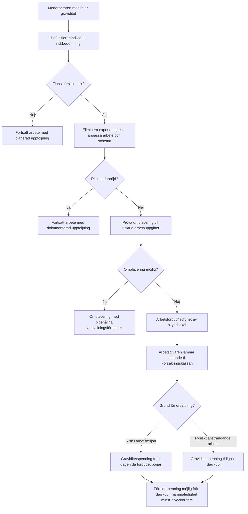

# Graviditet i arbetet för läkare i Region Stockholm

## Sammanfattning

För läkare anställda i Region Stockholm är den rättsliga huvudregeln i grunden gemensam oavsett sjukhus: arbetsgivaren ska göra en **tidig och individuell riskbedömning** så snart den gravida arbetstagaren har meddelat graviditeten, bedöma om exponering eller arbetsförhållanden kan skada graviditeten eller den ammade/nyligen födda barnet, och därefter i första hand **eliminera risken eller anpassa arbetet**, i andra hand **omplacera**, och först om detta inte går kan ett **arbetsförbud/avlägsnande från ordinarie arbete** bli aktuellt. De starkaste nationella rättskällorna är arbetsmiljölagstiftningen, föräldraledighetslagen, socialförsäkringsbalken, diskrimineringslagen, strålskyddslagen och Arbetsmiljöverkets föreskrifter och vägledningar. citeturn28search9turn30search1turn32view0turn34view0turn29search0

Det finns alltså **inte olika materiella regler** för gravida läkare på olika Region Stockholm-sjukhus i den meningen att något sjukhus skulle få tillämpa en lägre skyddsnivå. Däremot finns **praktiska och organisatoriska skillnader** mellan arbetsgivarmiljöerna inom regionen: olika vägar in till företagshälsovård, olika lokala stödfunktioner, olika publika HR-sidor och ibland olika grad av tydlighet eller aktualitet i lokal information. Region Stockholms medarbetarpolicy gäller för nämnder och bolag, men de lokala stödsystemen varierar mellan verksamheterna. citeturn42view3turn13search0turn13search2turn10search5

I praktiken är de viktigaste frågorna för en gravid läkare ofta dessa: exponering för **smittämnen**, **joniserande strålning**, **cytostatika/cytotoxiska eller andra reproduktionsstörande läkemedel**, **nattarbete/jourarbete**, och **fysisk belastning**. För flera av dessa områden finns uttryckliga skyddsregler; för andra krävs en kvalificerad individuell bedömning av faktisk exponering, immunitet, arbetsuppgifter, doser, skyddsutrustning, möjligheten till avskärmning och möjligheten till omplacering. citeturn30search1turn28search1turn28search8turn28search5turn29search0

Det som i vårdverksamhet ofta kallas **“avstängning”** är juridiskt normalt inte en disciplinär avstängning, utan ett **arbetsförbud eller en ledighet av skyddsskäl** när riskerna inte kan undanröjas. Om arbetstagaren förbjuds att fortsätta sitt vanliga arbete enligt arbetsmiljöreglerna har hon rätt till omplacering med bibehållna anställningsförmåner om det skäligen kan krävas; om omplacering inte är möjlig finns rätt till ledighet utan bibehållna anställningsförmåner, och då kan graviditetspenning bli aktuell från entity["organization","Försäkringskassan","swedish social insurance"]. citeturn32view0turn35view2turn39search10

Inför förlossningen finns flera parallella spår som måste hållas isär: **mammaledighet** enligt föräldraledighetslagen minst sju veckor före beräknad förlossning, **graviditetspenning** vid risk i arbetsmiljön från den dag arbetsförbudet börjar gälla eller vid fysiskt ansträngande arbete tidigast från dag 60 före beräknad förlossning, samt möjlighet att ta **föräldrapenning** från dag 60 före beräknad förlossning. För regionanställda gäller därutöver kollektivavtalet Allmänna bestämmelser med bland annat föräldrapenningtillägg, föräldralön, tre månaders anmälningsfrist för föräldraledighet och rätt till ledighet med full lön för två besök på barnmorskemottagning. citeturn32view0turn35view0turn35view2turn41view0turn41view1

Slutsatsen är att en gravid läkare i Region Stockholm bör utgå från att **reglerna är gemensamma men tillämpningen lokalt varierar**. Det avgörande blir därför inte främst “vilket sjukhus” utan hur snabbt och väl den lokala chefen, HR, skyddsombudet och företagshälsovården får till stånd en dokumenterad individuell bedömning, en rimlig arbetsanpassning och en korrekt handläggning av omplacering, arbetsförbud och ersättning. citeturn42view3turn36search8turn37search1turn35view1

## Nationella regler som styr graviditet i arbetet

Det nationella regelverket bygger på flera lager. entity["organization","Arbetsmiljöverket","swedish work env authority"] anger att gravida och ammande arbetstagare är särskilt känsliga för vissa arbetsmiljörisker och att riskerna ofta är störst tidigt i graviditeten. Arbetsgivaren ska därför **tidigt riskbedöma och förebygga** de särskilda riskerna. Arbetsmiljöarbetet ska bedrivas som en del av den dagliga verksamheten och omfatta fysiska, organisatoriska och sociala förhållanden av betydelse för arbetsmiljön. citeturn28search9turn30search5turn36search9

För själva ledighets- och omplaceringsfrågorna är föräldraledighetslagen central. Den ger rätt till **mammaledighet** i minst sju veckor före och sju veckor efter förlossningen, rätt till omplacering med bibehållna anställningsförmåner när arbetstagaren förbjudits att fortsätta sitt vanliga arbete enligt arbetsmiljöföreskrifter, rätt till omplacering från dag 60 före beräknad förlossning om den gravida inte kan utföra fysiskt påfrestande arbetsuppgifter, och – om omplacering inte är möjlig – rätt till ledighet så länge det krävs för att skydda hälsa och säkerhet, dock utan bibehållna anställningsförmåner under den ledigheten. citeturn32view0

Socialförsäkringsbalken och Försäkringskassans tillämpning fyller sedan det ekonomiska mellanrummet. En gravid arbetstagare kan få graviditetspenning om arbetet är fysiskt ansträngande eller om det finns risker i arbetsmiljön och arbetsgivaren inte kan omplacera henne. Vid risker i arbetsmiljön kan ersättning lämnas från den dag arbetsgivaren förbjuder arbete; vid fysiskt ansträngande arbete tidigast från dag 60 före beräknad förlossning. Ersättningen kan längst lämnas till och med dag 11 före beräknad förlossning. Därefter återstår främst föräldrapenning eller annan ledighet. citeturn35view0turn35view2

Arbetsgivaren får inte heller behandla gravida eller föräldralediga sämre i strid med diskrimineringslagen eller föräldraledighetslagen. Diskrimineringslagen förbjuder diskriminering i arbetslivet på grund av kön, och graviditetsrelaterat missgynnande faller under könsdiskriminering. Föräldraledighetslagen förbjuder missgynnande på grund av föräldraledighet, innehåller represalieförbud och ger i vissa fall rätt till ogiltigförklaring av uppsägning eller avskedande. citeturn34view0turn32view0turn38search4

För läkare som arbetar i miljöer med strålning gäller också strålskyddslagen. Om en gravid arbetstagare har anmält graviditeten ska arbetsuppgifterna planeras så att fosterdosen under återstående graviditet blir så låg som möjligt och inte förväntas överstiga 1 mSv. Begär den gravida arbetstagaren det, ska arbetsgivaren erbjuda arbetsuppgifter som inte innebär exponering utöver allmänhetens nivåer. citeturn29search0

### Översikt över vad som styr på nationell, regional och lokal nivå

| Nivå | Rättskälla eller styrning | Vad den betyder för gravida läkare |
|---|---|---|
| Nationell | Arbetsmiljölagen, Arbetsmiljöverkets graviditets- och riskregler | Kräver tidig individuell riskbedömning, riskeliminering och samverkan i arbetsmiljöarbetet. citeturn28search9turn30search1turn37search1 |
| Nationell | Föräldraledighetslagen | Reglerar mammaledighet, omplacering, skyddsledighet och anmälningsfrister enligt lag. citeturn32view0 |
| Nationell | Socialförsäkringsbalken/Försäkringskassan | Reglerar graviditetspenning, föräldrapenning före förlossning samt arbetsgivarutlåtande och handläggning. citeturn35view0turn35view1turn35view2 |
| Nationell | Diskrimineringslagen och föräldraledighetslagens skydd mot missgynnande | Ger skydd mot diskriminering, repressalier och vissa uppsägningar. citeturn34view0turn38search4 |
| Nationell | Strålskyddslagen | Särskilda dosgränser och omplaceringsrätt vid joniserande strålning. citeturn29search0 |
| Regional | Region Stockholms medarbetarpolicy | Gäller för regionens nämnder och bolag och slår fast att regionen ska vara en hållbar arbetsgivare med systematiskt arbetsmiljöarbete. citeturn42view3 |
| Regional | Kollektivavtalet Allmänna bestämmelser via entity["organization","SKR","swedish local authorities"] | Ger föräldrapenningtillägg, föräldralön, avvikande anmälningsfrist och viss betald ledighet för barnmorskebesök. citeturn41view0turn41view1 |
| Lokal | Sjukhus- och förvaltningsspecifika rutiner | Styr främst beslutsvägar, företagshälsovård och lokal tillämpning; offentligt tillgängliga, aktuella graviditetsdirektiv är ofta ospecificerade. citeturn10search5turn15search0turn19search0turn26view0turn25view0 |

En viktig tolkningsfråga är att regionala kunskapsstöd fortfarande ibland hänvisar till äldre AFS-numrering, särskilt AFS 2007:5, medan Arbetsmiljöverkets nuvarande webbstöd använder den nya regelstrukturen och hänvisar till AFS 2023:2 för vissa graviditetsspecifika bestämmelser, till exempel nattarbete. För praktisk tillämpning bör den **aktuella informationen på Arbetsmiljöverkets webbplats** ges företräde, men äldre regionalt material kan fortfarande vara användbart som sakstöd om det inte strider mot gällande regler. citeturn42view4turn28search5

## Region Stockholm och lokala skillnader mellan arbetsgivare

För en gravid läkare inom Region Stockholm är det praktiskt viktigt att skilja mellan tre arbetsgivarmiljöer: entity["organization","Karolinska Universitetssjukhuset","stockholm university hospital"], entity["organization","Stockholms läns sjukvårdsområde","slsos healthcare provider"] och entity["organization","Akutsjukhusnämnden","region stockholm acute hospitals"], där bland annat entity["organization","Danderyds sjukhus","danderyd stockholm hospital"], entity["organization","Södersjukhuset","sodermalm stockholm hospital"], entity["organization","Södertälje sjukhus","sodertalje stockholm hospital"] och entity["organization","S:t Eriks Ögonsjukhus","stockholm eye hospital"] ingår. Från 2025 samordnas dessa fyra akutsjukhus under Akutsjukhusnämnden, men varje förvaltning har egen ekonomistyrning. Det innebär att materiella regler i sak är gemensamma, medan den lokala HR- och arbetsmiljöpraktiken kan skilja sig åt. citeturn13search0turn13search2turn42view3

Regionens offentliga centrala medarbetar- och förmånssidor ger generellt stöd om arbetsmiljö och företagshälsovård, men de mest konkreta skillnaderna framträder i **lokala vägar till företagshälsovård och support**. På regionnivå anges att anställda har tillgång till företagshälsovård och kan kontakta den för stöd, rådgivning och en första bedömning vid arbetsrelaterade besvär. Lokalt ser det däremot olika ut. citeturn10search5

### Jämförelse mellan regionens större arbetsgivarmiljöer för gravida läkare

| Arbetsgivarmiljö | Offentligt tillgängligt stöd till medarbetaren | Offentligt tillgänglig graviditetsspecifik lokal rutin | Bedömning |
|---|---|---|---|
| Karolinska | Intern stödfunktion via Hälsocentrum för hälsa och arbetsmiljö. citeturn15search0 | Ingen aktuell, offentlig graviditetsspecifik rutin identifierad. | Stark intern stödstruktur verkar finnas, men publikt graviditetsdirektiv är ospecificerat. |
| SLSO | Företagshälsovård med möjlighet till självkontakt upp till två gånger per kalenderår. citeturn19search0 | Ingen aktuell, offentlig graviditetsspecifik rutin identifierad. | Tydlig FHV-ingång, men graviditetsrutin ej offentligt specificerad. |
| Danderyd | Falck företagshälsovård; självkontakt upp till tre gånger per år utan arbetsgivarens medgivande. citeturn26view0 | Ingen aktuell, offentlig graviditetsspecifik rutin identifierad. | Mest konkret offentlig FHV-process av de granskade sjukhusen. |
| Södertälje | Offentlig förmånssida med föräldraledighetsinformation i linje med AB:s 180/180-regel. citeturn22view0turn22view2 | Ingen aktuell, offentlig graviditetsspecifik rutin identifierad. | Föräldraledighetsinformationen är relativt tydlig; FHV-väg ej tydligt publicerad. |
| S:t Eriks | Offentlig förmånssida med 10 procent föräldrapenningtillägg i 180 dagar och uppgift om föräldralön efter viss kvalifikationstid. citeturn25view0 | Ingen aktuell, offentlig graviditetsspecifik rutin identifierad. | Tydlig lokal förmånssida, men inte graviditetsspecifik arbetsmiljörutin. |
| Södersjukhuset | Offentlig förmånssida med föräldrapenningtillägg, men med lokal uppgift om 356 dagars sammanhängande anställning. citeturn16view3 | Ingen aktuell, offentlig graviditetsspecifik rutin identifierad. | Lokal webbinformation avviker från nuvarande AB 25, vilket talar för att man bör luta sig mot kollektivavtalet vid rättstolkning. citeturn41view1 |

Den praktiska slutsatsen är därför att **skillnaderna mellan sjukhusen inte främst gäller vilka risker som räknas**, utan **hur snabbt och genom vilken kanal** riskbedömningen får expertstöd, hur lätt medarbetaren själv kan komma i kontakt med företagshälsovården, och hur väl lokal information är uppdaterad. För gravida läkare talar det för att man bör utgå från **nationell rätt + kollektivavtal + regionens medarbetarpolicy** som rättslig bottenplatta, och använda lokala sidor mest som operativ kontaktinformation. citeturn42view3turn41view1turn10search5

entity["organization","Centrum för arbets- och miljömedicin","region stockholm occ med"] är också relevant som regional expertresurs. CAMM erbjuder kostnadsfri rådgivning till gravida om risker i arbete eller omgivningsmiljö, särskilt för den som saknar tillgång till företagshälsovård. För regionanställda läkare är detta i första hand ett kompletterande expertstöd, inte en ersättning för arbetsgivarens ansvar. citeturn30search11turn36search8

## Riskbedömning och arbetsanpassning

Den juridiska kärnan är att arbetsgivaren måste göra en **individuell** bedömning. Arbetsmiljöverket betonar att det kan finnas särskilda risker för gravida och ammande där den allmänna riskbedömningen inte räcker, och att det är **exponeringen i arbetet** som är avgörande för hälsorisken. Det betyder att titeln “läkare” i sig säger för lite; bedömningen måste utgå från den faktiska tjänstgöringen: akutmottagning, operation, intervention, onkologi, infektionsmiljö, nattjour, tung rondverksamhet, laboratoriearbete, forskning eller administrativa uppgifter. citeturn30search5turn30search1turn28search8

I vårdverksamhet bör riskbedömningen typiskt dokumentera åtminstone: arbetsuppgifter, arbetstider, jour/natt, strålmiljö, läkemedelsexponering, smittexponering, fysisk belastning, behov av personlig skyddsutrustning, immunitetsfrågor när sådana är relevanta, vilka åtgärder som prövats samt om omplacering har utretts. Det följer inte av en enda checklista i lagtext, men är den praktiska konsekvensen av arbetsgivarens skyldighet att bedriva systematiskt arbetsmiljöarbete, ge skyddsombud insyn och fortlöpande pröva omplacering när behov finns. citeturn36search9turn37search1turn32view0

### Risker som särskilt bör bedömas för läkare

| Risktyp | Vad säger reglerna | Typisk betydelse för läkare |
|---|---|---|
| Smittämnen | Gravida som saknar fullgott immunitetsskydd får inte sysselsättas i arbete med risk för rubella eller toxoplasma; andra smittämnen kan också kräva individuell bedömning. Brott kan ge sanktionsavgift. citeturn28search10turn38search2turn38search9 | Relevans främst vid patientnära arbete i miljöer med smittexponering, särskilt om immunitetsstatus eller exponering är oklar. |
| Joniserande strålning | Fosterdosen ska hållas så låg som möjligt och inte förväntas överstiga 1 mSv under återstående graviditet; på begäran ska arbetsgivaren erbjuda uppgifter utan exponering över allmänhetens nivå. citeturn29search0 | Särskilt viktigt för intervention, radiologi, nuklearmedicin, hybrid-OP och vissa forskningsmiljöer. |
| Cytostatika och cytotoxiska eller reproduktionsstörande läkemedel | Arbetsgivaren ska alltid göra individuell riskbedömning av gravida, nyförlösta och ammande som kan exponeras. citeturn28search1turn28search8turn28search15 | Högst praktisk betydelse i onkologi, hematologi, apotek/läkemedelsberedning och vissa forskningsmiljöer. |
| Nattarbete | Om läkarintyg visar att nattarbete är skadligt för hälsa eller säkerhet får arbetsgivaren inte sysselsätta den gravida eller den som fött barn högst 14 veckor tidigare i nattarbete; dagarbete ska erbjudas om möjligt. citeturn28search5turn38search9 | Relevans för jourlinjer, beredskap, nattpass och långa återkommande pass med otillräcklig återhämtning. |
| Fysisk belastning | Fysisk belastning nämns uttryckligen som särskild risk; graviditetspenning kan lämnas vid fysiskt ansträngande arbete om omplacering inte är möjlig. citeturn30search1turn35view0turn35view2 | Gäller till exempel tunga patientförflyttningar, långvarigt stående, obekväma arbetsställningar och vissa jourintensiva akutmottagningspass. |
| Stötar, vibrationer, buller och andra faktorer | Arbetsmiljöverket anger dessa som exempel på särskilda risker som kan behöva bedömas. citeturn30search1 | Mindre vanliga för många läkare, men kan vara relevanta i vissa operations-, ambulans- eller tekniskt intensiva miljöer. |

När en risk väl identifierats ska arbetsgivaren inte börja i “avstängningsänden”. Rättsligt och praktiskt ska åtgärdsordningen vara: **eliminera eller minska exponeringen**, **ändra arbetsuppgifter eller arbetstid**, **omplacera till riskfria uppgifter**, och först därefter – om det fortfarande inte går att skydda arbetstagaren – **förbjuda fortsatt arbete i den aktuella rollen**. Arbetsmiljöverket, Försäkringskassan och SKR beskriver samma logik. citeturn28search8turn35view0turn39search10

För en gravid läkare kan arbetsanpassning därför i praktiken ofta betyda sådant som att flytta nattjour till dagarbete, byta från patientnära eller interventional verksamhet till mottagning, administrativt arbete, utbildning, forskning eller telemedicin, undanta från vissa läkemedelsmoment eller strålnära procedurer, eller att minska de mest belastande passen. Detta är inte automatiska rättigheter i exakt denna form, utan **praktiska exempel på hur lagens krav normalt kan operationaliseras** utifrån den faktiska risken. citeturn30search1turn28search1turn29search0turn39search10

Följande flöde sammanfattar den process som bör följas enligt föräldraledighetslagen, Arbetsmiljöverkets vägledning och Försäkringskassans handläggningsmodell. citeturn32view0turn28search9turn35view1turn35view2

## Avstängning, ledighet före förlossning och ersättning

Det är viktigt att skilja mellan **arbetsanpassning**, **omplacering**, **arbetsförbud/ledighet av skyddsskäl**, **graviditetspenning**, **mammaledighet** och **föräldrapenning före födseln**. Dessa blandas ofta ihop i praktiken, men har olika rättslig grund och olika beslutsfattare. citeturn32view0turn35view2turn41view1

### Vad som gäller i olika situationer

| Situation | När används den? | Vem beslutar? | Ersättning eller förmån |
|---|---|---|---|
| Arbetsanpassning | När risk kan undanröjas inom befintlig tjänst, till exempel via schemaändring eller ändrade uppgifter. citeturn28search9turn39search10 | Arbetsgivaren, ofta med HR/FHV-stöd. | Ordinarie lön. |
| Omplacering enligt 18 eller 19 §§ föräldraledighetslagen | När den gravida inte får fortsätta vanliga arbetet eller från dag 60 före BF vid fysiskt påfrestande uppgifter och omplacering skäligen kan krävas. citeturn32view0 | Arbetsgivaren. | Bibehållna anställningsförmåner. citeturn32view0 |
| Ledighet av skyddsskäl enligt 20 § | När omplacering inte är möjlig men skyddet kräver att arbetet upphör. citeturn32view0turn39search10 | Arbetsgivaren. | Ingen bibehållen anställningsförmån från arbetsgivaren enligt lagen; då blir graviditetspenning ofta nästa steg. citeturn32view0turn35view2 |
| Graviditetspenning på grund av risk i arbetsmiljön | När arbetsgivaren förbjudit fortsatt arbete på grund av risk och omplacering inte kan ordnas. citeturn35view0turn35view2 | Försäkringskassan efter ansökan. | Från dagen arbetsförbudet börjar till och med dag 11 före BF. citeturn35view2 |
| Graviditetspenning på grund av fysiskt ansträngande arbete | När arbetet är för fysiskt ansträngande och omplacering inte kan ordnas. citeturn35view0turn35view2 | Försäkringskassan efter ansökan. | Tidigast från dag 60 före BF till och med dag 11 före BF. citeturn35view0turn35view2 |
| Mammaledighet | Lagstadgad ledighet i samband med födsel. citeturn32view0 | Arbetstagaren begär ledighet, arbetsgivaren ska hantera den. | Minst sju veckor före och sju veckor efter förlossning; inte beroende av att föräldrapenning tas ut. citeturn32view0 |
| Föräldrapenning före födsel | Om graviditetspenning inte används eller när den upphör. citeturn35view2turn42view6 | Försäkringskassan. | Kan tas från dag 60 före beräknad förlossning. citeturn35view2turn42view6 |

För regionanställda läkare tillkommer kollektivavtalets förmåner. Allmänna bestämmelser 2025 anger att föräldrapenningtillägg lämnas efter minst 180 kalenderdagars sammanhängande anställningstid, under sammanlagt 180 kalenderdagar per födsel och längst tills barnet är 24 månader. För den som har lön över avtalsgränsen kan dessutom föräldralön lämnas i högst 270 kalenderdagar efter minst 180 dagars sammanhängande offentlig anställning före ledigheten. citeturn41view1

Det regionalt tillämpliga kollektivavtalet innehåller också två detaljbestämmelser som ofta förbises men är praktiskt viktiga för läkare: anmälan om föräldraledighet ska enligt avtalet göras **minst tre månader** före ledighetens början om inte särskilda skäl finns, och den blivande föräldern har rätt till ledighet med **100 procent lön vid högst två besök på barnmorskemottagning**. Detta är en avvikelse från lagens tvåmånadersregel och en konkret kollektivavtalsförmån för regionanställda. citeturn41view0turn32view0

En praktisk komplikation är att lokala informationssidor inte alltid är helt synkroniserade med gällande kollektivavtal. Södertälje anger samma 180-dagarskvalifikation som AB 25, medan Södersjukhusets lokala sida fortfarande anger 356 dagars sammanhängande anställning för föräldrapenningtillägg. För rättstolkningen bör därför aktuellt kollektivavtal väga tyngst än lokala rekryterings- eller förmånssidor när dessa inte stämmer överens. citeturn22view0turn41view1turn16view3

## Roller, dokumentation och rättsmedel

Arbetsgivaren har huvudansvaret. Det är arbetsgivaren som ska utreda riskerna, samverka med arbetstagaren, involvera skyddsombud, anlita företagshälsovård eller annan sakkunnig hjälp när den egna kompetensen inte räcker, och lämna besked om möjligheten till omplacering snarast möjligt efter att behovet har anmälts. Om omplacering inte är möjlig ska arbetsgivaren dessutom fortlöpande pröva om det senare uppkommer en sådan möjlighet. citeturn36search7turn32view0turn37search1

Företagshälsovården är alltså **expertstöd**, inte beslutsfattare. Arbetsmiljöverkets regler kräver att arbetsgivaren anlitar företagshälsovård eller motsvarande sakkunnig hjälp när kompetensen i den egna verksamheten inte räcker för det systematiska arbetsmiljöarbetet eller arbetet med arbetsanpassning och rehabilitering. För gravida läkare blir detta särskilt viktigt i frågor om dosbedömning, läkemedelsexponering, smittrisk, schemabelastning och arbetsförmåga. citeturn36search7turn36search13

Den behandlande läkaren eller barnmorskan har däremot en mer begränsad roll i just den **arbetsmiljörättsliga** processen. För graviditetspenning krävs normalt **inte** något medicinskt underlag från hälso- och sjukvården; som regel räcker graviditetsintyg och arbetsgivarens utlåtande. Medicinska intyg blir främst relevanta om den gravida är sjuk, om sjukskrivning övervägs, eller om ett **läkarintyg** behövs för att nattarbete bedöms skadligt för hennes hälsa eller säkerhet. citeturn35view0turn35view1turn28search5turn38search9

Skyddsombudet har en stark formell roll. Skyddsombud ska delta i planering av ändrade arbetsprocesser, arbetsmetoder, arbetsorganisation och handlingsplaner. Ombudet har rätt till handlingar och upplysningar, kan begära åtgärder eller särskild undersökning enligt 6 kap. 6 a § arbetsmiljölagen och kan – om rättelse inte sker inom skälig tid – vända sig till Arbetsmiljöverket. Vid omedelbar och allvarlig fara för liv eller hälsa kan skyddsombudet även stoppa arbetet i avvaktan på myndighetens ställningstagande. citeturn43view0

### Dokument som normalt bör finnas eller upprättas

| Dokument eller underlag | Vem ansvarar | Varför det behövs |
|---|---|---|
| Tidig anmälan om graviditet till chef | Arbetstagaren | Utlöser arbetsgivarens särskilda bedömningsskyldighet. citeturn28search9turn32view0 |
| Individuell riskbedömning | Chef/arbetsgivare, ofta med HR/FHV | Visar vilka risker som identifierats och vilka åtgärder som prövats. citeturn28search9turn36search8 |
| Beslut om arbetsanpassning eller omplacering | Arbetsgivaren | Behövs för rättssäker hantering och fortsatt uppföljning. citeturn32view0turn39search10 |
| Utlåtande till Försäkringskassan | Arbetsgivaren | Obligatoriskt när graviditetspenning söks. citeturn35view1turn35view2 |
| Intyg om graviditet | Barnmorska eller mödravård | Normalt tillräckligt medicinskt underlag för graviditetspenning. citeturn35view0turn35view2 |
| Läkarintyg vid nattarbete eller sjukskrivning | Behandlande läkare | Relevanta när nattarbete bedöms skadligt eller när graviditet/symtom blir sjukdomsgrundande. citeturn28search5turn38search9 |
| 6:6 a-begäran eller annan samverkansdokumentation | Skyddsombud | Rättsmedel om arbetsgivaren inte agerar tillräckligt. citeturn43view0 |

När den gravida läkaren inte delar arbetsgivarens bedömning finns flera spår. Det mest arbetsmiljörättsliga är att involvera skyddsombud och vid behov använda 6:6 a-vägen till Arbetsmiljöverket. Det mest socialförsäkringsrättsliga är att begära omprövning av Försäkringskassans beslut inom två månader och därefter överklaga vidare. Det mest arbetsrättsliga och diskrimineringsrättsliga är att driva frågan fackligt eller via entity["organization","Diskrimineringsombudsmannen","swedish equality ombudsman"]/domstol om det finns missgynnande, repressalier eller diskriminering. citeturn38search0turn38search11turn38search4turn39search12

Ett särskilt intressant rättsfall är AD 2025 nr 57 från entity["organization","Arbetsdomstolen","swedish labour court"]. Målet gällde gravida offentligt anställda arbetstagare som under covid-pandemin förbjöds att arbeta av arbetsmiljöskäl. Arbetsdomstolen redogjorde för att svensk rätt bygger på omplacering med bibehållna anställningsförmåner enligt 18 § föräldraledighetslagen och därefter ledighet utan bibehållna anställningsförmåner enligt 20 §, kombinerat med graviditetspenning enligt socialförsäkringsbalken. Domstolen uttalade också att EU-rätten kunde kräva en högre inkomstnivå än vad graviditetspenningen ensam gav i den offentliga sektorn. För Region Stockholm som offentlig arbetsgivare är domen därför analytiskt viktig när lokala arbetsförbud aktualiseras. citeturn40view0turn42view5turn42view6

## Praktiska checklistor

### Checklista för chef och HR

- Ta emot graviditetsanmälan tidigt och initiera omedelbart en **individuell riskbedömning**. Vänta inte till vecka 28 eller till att symtom uppstår; Arbetsmiljöverket betonar att risker ofta är störst tidigt i graviditeten. citeturn28search9
- Kartlägg faktisk exponering: patientnära smitta, nattarbete, strålning, läkemedelsexponering, fysisk belastning och behov av skyddsutrustning. Dokumentera vad som faktiskt ingår i tjänstgöringen, inte bara en generell tjänstebeskrivning. citeturn30search1turn28search8turn29search0
- Pröva åtgärder i rätt ordning: eliminera risk, anpassa arbetet, omplacera. Arbetsförbud ska vara sista steget. citeturn39search10turn32view0
- Ta in företagshälsovård eller annan expertis om den lokala chefen saknar kompetens att bedöma doser, smittämnen, läkemedelsrisker eller schemabelastning. citeturn36search7
- Involvera skyddsombud och säkerställ att dokumentation finns för riskbedömning, prövade åtgärder, omplaceringsmöjligheter och beslut. citeturn43view0
- Om graviditetspenning blir aktuell, lämna arbetsgivarutlåtandet utan dröjsmål. Om ledigheten gäller föräldraledighet, kom ihåg att kollektivavtalet i regionsektorn normalt kräver tre månaders föranmälan. citeturn35view1turn41view0

### Checklista för den gravida läkaren

- Meddela chef tidigt. Den särskilda skyddsprocessen startar först när arbetsgivaren känner till graviditeten. citeturn28search9
- Beskriv exakt vilka delar av arbetet som kan vara riskabla: nattjour, intervention, cytostatika, smittexponering, tunga pass, patientförflyttningar, brist på återhämtning. Ju mer konkret du är, desto bättre blir riskbedömningen. citeturn30search1turn28search1turn29search0
- Be om skriftlig dokumentation av riskbedömning, arbetsanpassning och omplaceringsbedömning. Det underlättar både intern dialog och en eventuell ansökan till Försäkringskassan. citeturn35view1turn32view0
- Om du inte får ett rimligt svar: involvera skyddsombud tidigt. Skyddsombudet har rätt att begära åtgärder och undersökningar och kan i nästa steg gå till Arbetsmiljöverket. citeturn43view0
- Håll isär olika ersättningar: graviditetspenning, föräldrapenning före födsel, mammaledighet, kollektivavtalat tillägg och eventuell sjukpenning vid sjukdom. citeturn35view2turn32view0turn41view1
- Om du får avslag från Försäkringskassan: begär omprövning inom två månader. Om du blir missgynnad därför att du är gravid eller föräldraledig kan du ha rätt till skadestånd eller diskrimineringsersättning. citeturn38search0turn38search11turn34view0

Den mest robusta praktiska tumregeln är därför följande: **utgå från nationell rätt och kollektivavtal, använd regionens medarbetarpolicy som arbetsgivarbas, och se lokala sjukhusrutiner som operativt stöd men inte som sista ordet i rättsfrågan**. När offentlig och lokal information krockar – som i exemplet med Södersjukhusets kvalifikationstid för föräldrapenningtillägg – bör den gravida läkaren och arbetsgivaren kontrollera vad som faktiskt gäller i aktuellt kollektivavtal och i gällande nationella regler. citeturn41view1turn16view3turn42view3